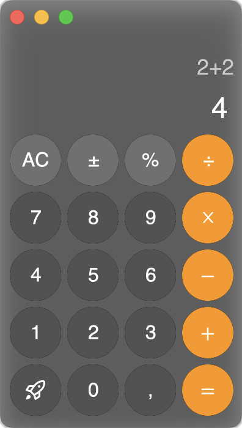

# hello-gpui
Me learning how to use [gpui](https://www.gpui.rs/).

## Bootleg Calculator

Apple's Calculator bootleg copy. It works somewhat ok, but of course not really
production ready. However, it does the following:

1. Calculation of Addition, Subtraction, Division and Multiplication.
2. Shows previous operation.
3. Keyboard shortcuts.
4. Buttons illuminate on key press.
